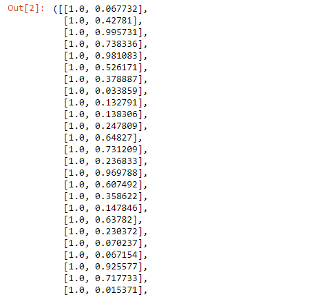
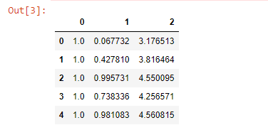
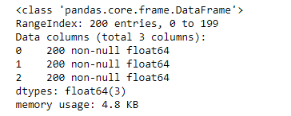
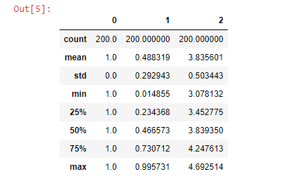
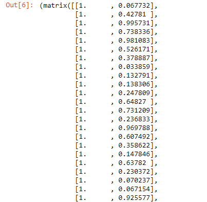
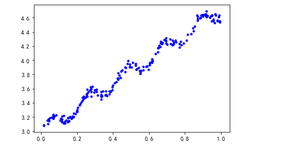
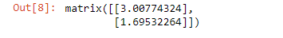
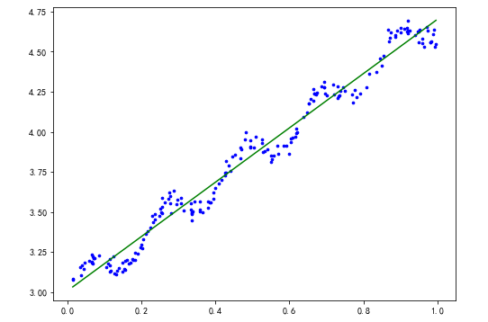
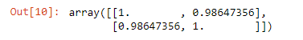
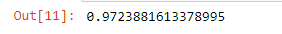

## 本章内容介绍

本章将介绍线性回归，进行python3.6的实现。在这之后引入了局部平滑技术，分析如何更加的拟合数据。接下来本章将探讨回归在“欠拟合”的情况下的缩减(shrinkage)技术，探讨偏差和方差的概念。最后，我们将融合所有技术，预测鲍鱼的年龄介绍和玩具的售价。此外为了获取一些玩具的数据，我们还将使用python来做一些采集的工作。这一章的内容会十分丰富。

### 用线性回归找到最佳拟合曲线
回归的目的预测数值型的目标值，最直接的方法是依据输入写一个目标值的计算公式。假如你想要预测姐姐男友汽车的功率大小，可能会这样算：


$$HorsePower=0.0015*annualSalary-0.99*horseListeningToPublicRadio$$

这就是所谓的回归方程(regression equation)，其中的0.0015和-0.99称为回归系数(regression weights)，求这些回归系数的过程就是回归。一旦有了这些回归系数，再给定输入，做预测就非常容易了。具体的做法是用回归系数乘以输入值，在将结果全部加在一起，就得到了预测值。


应当怎样从一大堆的数据求出回归方程呢？假定输入数据存放在矩阵**X**中，而回归系数存放在向量w中。那么对于给定的数据$x_1$，预测结果将会通过$Y_1=X^T_1w$给出。现在的问题是，手里有一些x和对应的y，怎样才能找到w呢？一个常用的方法就是找出误差最小的w。这里的误差是指预测y值和真实y值之间的差值，使用该误差的简单累加将使得正差值和负差值相互抵消，所以我们采用评查误差。


平方误差可以写做：


$$\sum_{i=1}^m(y_i-x^T_iw)^2$$

用矩阵表示还可以写做$(y-Xw)^T(y-Xw) $。如果对w求导，得到$X^T(y-Xw)$，令其等于零，解出w如下：


$$\frac{\partial (y-Xw)(y-Xw)^T}{\partial w}$$

$$= \frac{\partial(y-Xw) (y^T- X^Tw^T)}{\partial w}$$

$$\frac{\partial y^Ty -y^TXw-w^TX^Ty+w^TX^TXw}{\partial w}$$

$$=-2X^T(y-Xw)$$

令其等于0

$$\frac{\partial (y-Xw)(y-Xw)^T}{\partial w}=0$$

$$-2X^T(y-Xw) =0$$

$$X^T(y-Xw)=0$$

$$X^Ty -X^TXw=0$$

当$$|X^TX| \neq 0$$:

$$w=(X^TX)^{-1}X^Ty$$

w上方的小标记表示，这是当前可以估计的w的最优解。从现有数据上估计的w可能并不是数据中的真实的w值，所以使用了一个“帽”符号来表示它仅使w的一个最佳估计

接下来介绍如何给出该数据的最佳拟合直线


#### 导入所需要的包

```
import numpy as np
import pandas as pd
import matplotlib.pyplot as plt
import matplotlib as mpl
import random
#显示中文，否则为小方框
plt.rcParams['font.sans-serif'] = ['simhei'] 
plt.rcParams['axes.unicode_minus'] = False
%matplotlib inline
```
####   数据导入


```
def loadDateSet(fileName):
    '''
    函数功能：
        将每行的前len-1列和最后一列的数据转换为矩阵
    参数：
        fileName__文件名
    返回值：
        特征矩阵，标签矩阵
    '''
    numFeat = len(open(fileName).readline().split('\t')) -1 # 获取特征个数
    dataMat = []   
    labelMat = []
    fr = open(fileName)
    # 遍历每一行数据
    for line in fr.readlines():
        lineArr = []
        curLine = line.strip().split('\t')
        # 对每一行数据进行处理
        for i in range(numFeat):
            lineArr.append(float(curLine[i])) # 将n-1个特征组成一个list
        dataMat.append(lineArr) # 双list形成矩阵
        labelMat.append(float(curLine[-1])) # 将最后一个数值作为目标值
    return dataMat, labelMat   # 返回特征矩阵，标签矩阵
# 测试函数
loadDateSet("ex0.txt")
```
输出部分结果(仅作为展示所用)



### 查看数据信息

```
# 使用pandas进行导入数据
ex0 = pd.read_table('ex0.txt', header = None)
# 显示前五行数据
ex0.head() 
```



```
# 查看数据信息
ex0.info()
```




```
# 查看数据统计信息
ex0.describe()
```



```
# 使用pandas获取特征矩阵，标签矩阵
def get_Mat(dataSet):
    '''
    函数功能：
        获取特征矩阵和标签矩阵
    参数：
        dataSet__数据集
    返回值：
        特征矩阵，标签矩阵
    '''
    # 位置索引，不包括-1.得到xMat
    xMat = np.mat(dataSet.iloc[:, :-1].values)
    # 位置索引，-1，得到yMat
    yMat = np.mat(dataSet.iloc[:,-1].values).T
    return xMat, yMat
# 函数测试
get_Mat(ex0)
```
输出部分结果(仅作为展示所用)



### 可视化数据
```
def plotDataSet(dataSet):
    '''
    函数功能：
        数据可视化
    参数：
        dataSet__数据集
    return:
        可视化结果(散点图)
    '''
    xMat, yMat = get_Mat(dataSet)
    plt.scatter(xMat.A[:,-1], yMat.A, c='b', s=10)
    plt.show()
# 函数测试
plotDataSet(ex0)
```




### 计算回归系数


```math
\hat{w}=(X^TX)^{-1}X^TY
```
上述公式中包含$(X^TX)^{-1}$，也就是需要对矩阵求逆，因此这个方程只在逆矩阵的时候适用。然而，矩阵的逆可能并不存在，因此必须要在代码中对此作出判断
```
def standRegres(dataSet):
    '''
    函数功能：
        计算回归系数ws
    参数：
        dataSet__数据集
    返回值：
        ws__回归系数
     '''
    # 根据get_Mat函数返回xMat, yMat
    xMat, yMat = get_Mat(dataSet)
    xTx = xMat.T * xMat
    # 行列式不能为0
    if np.linalg.det(xTx) == 0:
        print("This matrix is singular, cannot do inverse")
    # 计算回归系数
    ws = xTx.I * (xMat.T * yMat)
    return ws
#函数测试
standRegres(ex0)
```



### 拟合数据

```
def plotReg(dataSet):
    '''
    函数功能：
        描绘数据集图像以及预测图像
    参数:
        dataSet__数据集
    返回值
    '''
    # 根据get_Mat函数返回xMat, yMat
    xMat, yMat = get_Mat(dataSet)
    # 创建画布
    fig = plt.figure(figsize=(8,6))
    # 111，表示为将图像分为1行1列，此子图占据从左到右从上到下的1位置
    # 234，表示为将图像分为2行3列，取从左到右，从上到下第4个位置
    ax = fig.add_subplot(111)
    # 描绘数据图像
    ax.scatter(xMat.A[:,-1], yMat.A, c='b', s=7)
    # 复制一份数据
    xCopy = xMat.copy()
    # 如果直线上的数据点次序混乱，绘图时将会出现问题，所以首先要将点按照升序排列
    xCopy.sort(0)
    # 根据standRegres函数返回回归系数
    ws = standRegres(dataSet)
    # 根据回归系数以及特征矩阵得到预测值
    yHat = xCopy * ws
    # 描绘预测函数图像
    ax.plot(xCopy[:,1], yHat, c="g")
    plt.show()
# 函数测试
plotReg(ex0)
```


### 计算相关系数

相关系数：通过命令corrcoef(yEstimate, yActual)来计算预测值与真实值之间的相关性

```
# 根据get_Mat函数返回xMat, yMat
xMat,yMat = get_Mat(ex0)
# 计算回归系数
ws = standRegres(ex0)
# 计算预测值
yHat = xMat * ws
# 计算相关系数(必须为行向量)
np.corrcoef(yHat.T, yMat.T)
# yMat和自己的匹配最完美，对角线上的数据为1.0。而yHat和yMat的相关系数为0.98
```



### 评估
```
# 导入R^2评估指标
from sklearn.metrics import r2_score
r2_score(yHat,yMat)
```


最佳拟合直线的方法将数据视为直线进行建模，R^2有0.97，相关系数为0.98。看起来是一个不错的表现，但是我们发现数据呈现有规律的波动，我们拟合出来的直线没有很好的拟合这些波动的数据。


